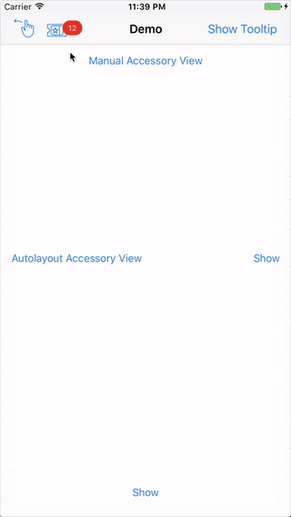

## KSOTooltip

*KSOTooltip* is an iOS framework for displaying informational tooltips. It can display text or attributed text from a view or bar button item. It can display an optional accessory view below the tooltip text.

Demo icons by [Glyphish](http://www.glyphish.com/).

### Installation

You can install *KSOTooltip* using [cocoapods](https://cocoapods.org/), [Carthage](https://github.com/Carthage/Carthage), or as a framework. When installing as a framework, ensure you also link to [Stanley](https://github.com/Kosoku/Stanley), [Ditko](https://github.com/Kosoku/Ditko), [Agamotto](https://github.com/Kosoku/Agamotto) and [Loki](https://github.com/Kosoku/Loki) as *KSOTooltip* relies on them.

### Dependencies

Third party:

- [Agamotto](https://github.com/Kosoku/Agamotto)
- [Ditko](https://github.com/Kosoku/Ditko)